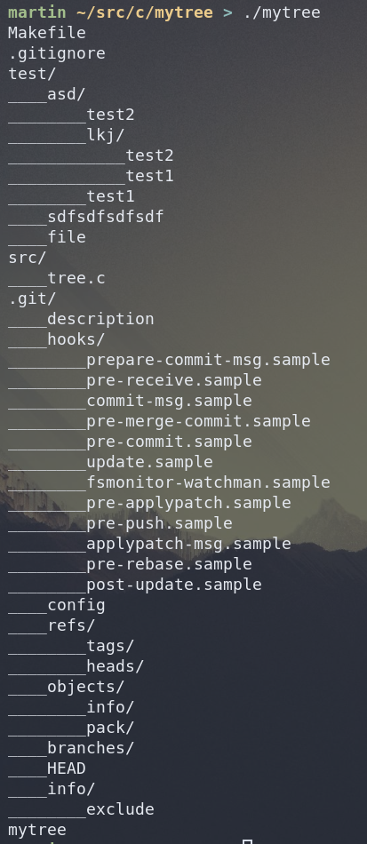

# mytree
A tree command I made in C, with some inspiration from the code in https://github.com/Tsoding/dedup



## Quickstart

### Build
```sh
make build
```

### Run
```sh
make run
```
or
```sh
./mytree
```

## Args

- `./mytree -h`
    Show hidden files (dotfiles)
- `./myfree -i <file>`
    Ignore all files with that name
